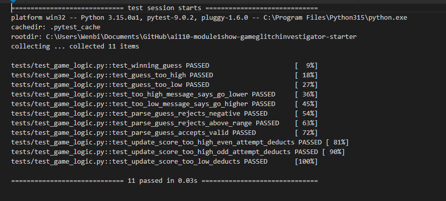

# 🎮 Game Glitch Investigator: The Impossible Guesser

## 🚨 The Situation

You asked an AI to build a simple "Number Guessing Game" using Streamlit.
It wrote the code, ran away, and now the game is unplayable. 

- You can't win.
- The hints lie to you.
- The secret number seems to have commitment issues.

## 🛠️ Setup

1. Install dependencies: `pip install -r requirements.txt`
2. Run the broken app: `python -m streamlit run app.py`

## 🕵️‍♂️ Your Mission

1. **Play the game.** Open the "Developer Debug Info" tab in the app to see the secret number. Try to win.
2. **Find the State Bug.** Why does the secret number change every time you click "Submit"? Ask ChatGPT: *"How do I keep a variable from resetting in Streamlit when I click a button?"*
3. **Fix the Logic.** The hints ("Higher/Lower") are wrong. Fix them.
4. **Refactor & Test.** - Move the logic into `logic_utils.py`.
   - Run `pytest` in your terminal.
   - Keep fixing until all tests pass!

## 📝 My Experience

### Game Purpose

A number guessing game where the player picks a difficulty, gets a secret number in a range, and tries to guess it within a limited number of attempts. The app gives higher/lower hints after each guess and tracks a running score.

### Bugs Found

| 1 | Hint messages were swapped — "Too High" said "Go HIGHER!" and "Too Low" said "Go LOWER!" | `check_guess` in `app.py` |
| 2 | Secret was cast to a string on even-numbered attempts, breaking numeric comparison | `app.py` submit block |
| 3 | Negative numbers and out-of-range values were accepted (no range validation) | `parse_guess` |
| 4 | "Too High" guesses on even attempts awarded +5 points instead of deducting -5 | `update_score` |
| 5 | New game button did not reset score, history, or game status | `app.py` new_game block |
| 6 | Attempts counter started at 1 instead of 0, making the first guess count as attempt 2 | `app.py` session state init |

### Fixes Applied

- Moved all four logic functions (`check_guess`, `parse_guess`, `get_range_for_difficulty`, `update_score`) out of `app.py` into `logic_utils.py` and updated the import.
- Fixed hint messages so "Too High" → "Go LOWER!" and "Too Low" → "Go HIGHER!".
- Removed the even/odd string cast on the secret number so comparisons are always numeric.
- Added range validation to `parse_guess` so values outside `[low, high]` are rejected without consuming an attempt.
- Fixed `update_score` to always deduct 5 points for wrong guesses regardless of attempt parity.
- Fixed the new game reset to clear score, history, attempts, and status.
- Added 11 pytest cases covering all fixed bugs — all passing.

## 📸 Demo

- [ ] 

## 🚀 Stretch Features

- [ ] [If you choose to complete Challenge 4, insert a screenshot of your Enhanced Game UI here]
